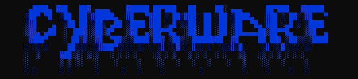

# CyberWare
CyberWare is a open source **exploit prevention software**



CyberWare is a software that makes staying safe on the internet **easy**

it allows the user to **scan messages,scan links,etc** from other users on the internet
and it show the user if a message,link is safe or the user is safe they messageing is safe

the main way and reason poeple get hacked is other poeple telling them to do something with a message

you might have even gotten a message like this before
```
Hey so i have been working on a game
and i need play testers so could you test my game
```
most poeple would think "that's obviously a virus"
but thats only beacuse you **thinking about it**

most of the time on the on the internet poeple **dont think about that much**
and end up geting **hacked,scamed,etc**

beacause of this CyberWare was made to make staying safe on the internet **easy**.

To learn more about CyberWare and how to use it goto the [**Documentation**](Documentation/Dictionrary.md)
